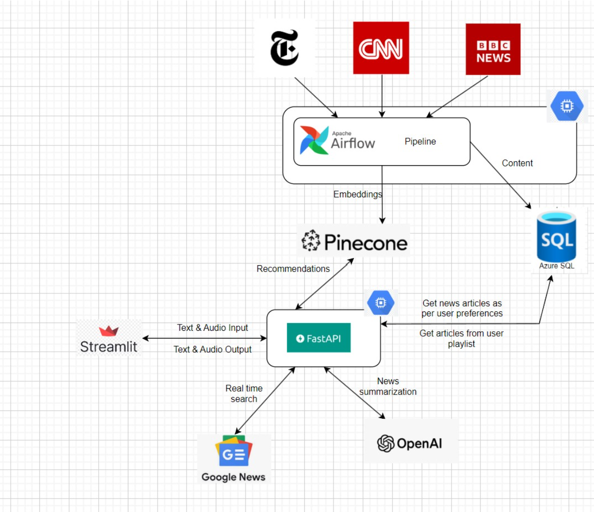
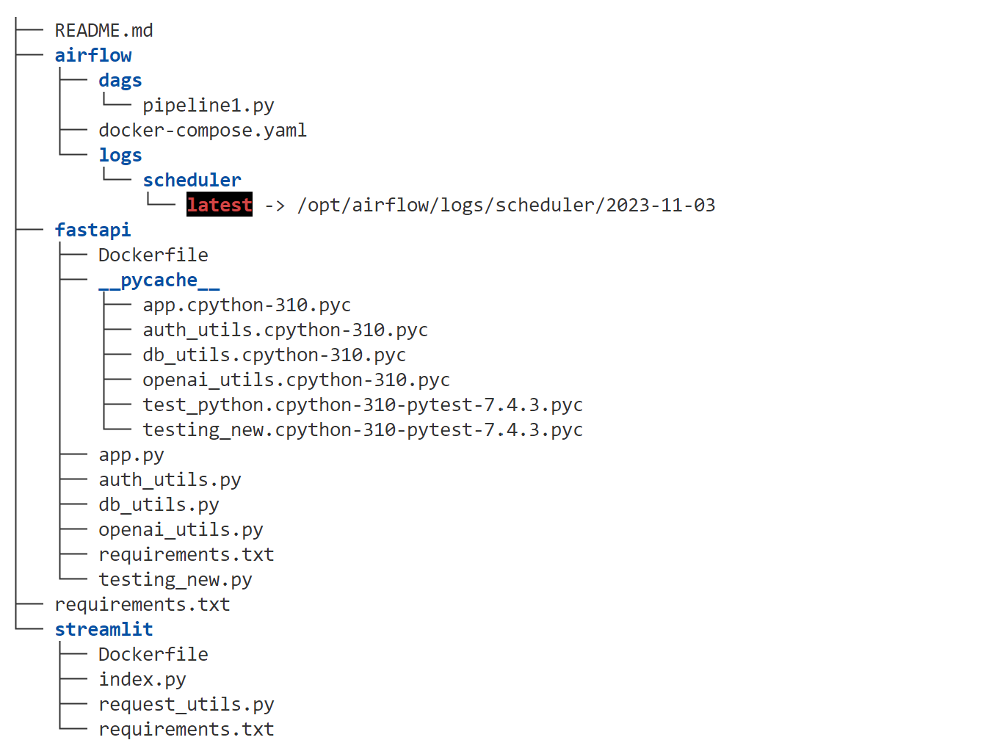

# Final_Project

### AI-Enhanced NewsSphere: A Personalized News Digest Platform

Introducing a news application project that lets you stay informed and organized effortlessly. 

With this app, you can read the latest news and even add your favorites to a personalized playlist. Enjoy the option to listen to the news directly, sourced from reputable outlets like Google News, BBC, NY Times, and more, all tailored to your preferences. If you prefer not to store articles permanently, simply queue them up for a quick listen. Additionally, you have the flexibility to add articles to a playlist for easy access later. We've made sure to summarize all news articles, saving you valuable time. Stay updated and organized with our user-friendly news app!

## Project Resources

Google collab notebook: https://colab.research.google.com/drive/1-u0u6Ib5aPGprUhVwmp_Yj_Ie-FEaNgi?usp=sharing

Google codelab: [https://codelabs-preview.appspot.com/?file_id=1Ih2p01AQZP2_p7pM-CWIECQJQams-EnPEwdwYNav838#0](https://codelabs-preview.appspot.com/?file_id=1tJ3JqcmwDDNBPkk97BcidnZiWHzzjm5QJaESpIeejAw#0)

App link (hosted on Google Cloud): http://34.118.251.190:8501/

App link (hosted on Streamlit Cloud): https://bigdatateam2-finalproject.streamlit.app/

Airflow: http://34.118.251.190:8080/home

FAST API: http://34.118.251.190:8000/docs

Youtube Video URL: https://www.youtube.com/watch?v=hqx6lcAuugc

### Tech Stack
Python | Streamlit | OpenAI | Azure SQL | Pinecone | Docker | Google Cloud | Fast API | Airflow

### Architecture diagram ###

### Project Flow

1) Start by registering in our application to personalize your news experience. Specify your interests in sections like America, Business, Environment, and more during the registration process. Once registered, log in to discover the top 5 news articles in your selected section. Read them at your pace or listen to them with the play option.

2) For added convenience, create a queue for preferred articles. These queued articles will play consecutively but won't be stored in the database. Alternatively, organize your favorite articles by creating playlists, which are saved in the database for easy access later. Manage your playlists by modifying or deleting them as needed.

3) Our user login operates through JWT for secure access. Additionally, we've implemented an Airflow system scheduled to run every 8 minutes. This system stores all articles in the database, incorporating a feature that adds only new or changed articles. Stay seamlessly connected to the latest news with our user-friendly and efficient features.

### Repository Structure

### Contributions

| Name                            | Contribution                                                                            |  
| ------------------------------- | ----------------------------------------------------------------------------------------|
| Shardul Chavan                  | Text to speech Integration, Streamlit layout, Speech to Text Integration, Playlists     | 
| Chinmay Gandi                   | Airflow, Pinecone Integration, Playlists , Azure Data Storage                           | 
| Dhawal Negi                     | JWT, Dockerization, GCP Deployment, FAST API                                            |                                                  

### Additional Notes
WE ATTEST THAT WE HAVEN’T USED ANY OTHER STUDENTS’ WORK IN OUR ASSIGNMENT AND ABIDE BY THE POLICIES LISTED IN THE STUDENT HANDBOOK. 

